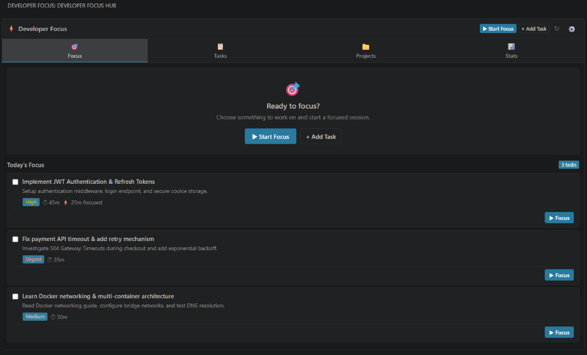

<div align="center">

# Know

> **A free developer workspace for tasks, focus sessions, projects, and coding activity inside VS Code.**

[](https://code.visualstudio.com/)
[](LICENSE)
[](https://github.com/sonisuryansh/Know)
[](README.md#privacy--data-storage)

<br>

<p align="center">
  
  <br>
  <em>Know — a focused development workspace inside VS Code.</em>
</p>

</div>

---

## 📖 What is Know?

**Know** is a focused developer workspace built directly into Visual Studio Code. It brings your daily planning, focus timers, project management, and activity tracking into a single unified sidebar without forcing you to switch between browser tabs, external to-do apps, and timer tools.

With Know, you can:
- **Plan & Organize:** Capture quick thoughts in your Inbox and curate your daily focus queue.
- **Deep Flow Sessions:** Run distraction-free focus sessions with live countdowns on your status bar.
- **Manage Projects:** Organize tasks by project and jump directly into local workspaces.
- **Import GitHub Repositories:** Clone GitHub projects and link them directly inside your workspace.
- **Track Activity:** Visualize your coding consistency with a 52-week activity heatmap and streak tracking.

---

## 💡 Why Know?

Developers lose significant focus when constantly switching context between code editors, external timers, browser-based trackers, and task management apps.

**Know keeps you in flow:**
- 🚫 **No External Tools:** Run focus timers and task lists without leaving your editor.
- 🎯 **Deep Focus Mode:** Flexible countdown presets (`25m`, `45m`, `60m`, `90m`), custom timers, or stopwatch tracking.
- 📄 **Context-Aware File Linking:** Associate open editor files directly with tasks and jump right back with one click.
- 📈 **Visual Progress:** Automatic 52-week activity heatmap, daily streaks, and category breakdowns.
- 🎨 **100% Native Theme Adaptive:** Seamlessly matches your VS Code theme (Dark+, Light+, High Contrast).
- 🔒 **100% Private & Offline:** Zero telemetry, no cloud accounts, and all data stored locally on your machine.

---

## 🚀 Key Features

```
┌────────────────────────────────────────────────────────────────────────┐
│                           KNOW WORKSPACE                               │
├──────────────┬──────────────────┬──────────────────┬───────────────────┤
│  🎯 FOCUS    │    📋 TASKS      │   📁 PROJECTS    │    📊 STATS       │
│  • Timers    │  • Quick Inbox   │  • Git Connect   │  • 52-Wk Heatmap  │
│  • Stopwatch │  • Today's Queue │  • Folders       │  • Day Streaks    │
│  • Status Bar│  • File Links    │  • Progress      │  • Time Breakdown │
└──────────────┴──────────────────┴──────────────────┴───────────────────┘
```

### 1. 🎯 Smart Focus Timers
- **Flexible Durations:** Choose standard intervals (`25m`, `45m`, `60m`, `90m`), input a custom duration, or use open-ended stopwatch mode.
- **Live Session Controls:** Pause, resume, extend by `+5m`, or finish sessions with summary notes.
- **Status Bar Integration:** Displays real-time timer countdown and active project context directly in your status bar (`$(flame) Know: 24:35`).

### 2. 📋 Frictionless Task Management
- **Instant Quick Capture:** Rapidly save ideas to your Inbox with a single `Enter` press.
- **Today's Focus Queue:** Curate your daily goals and work through them sequentially.
- **Priorities & Metadata:** Tag tasks with `Low`, `Medium`, `High`, or `Urgent`, assign estimated durations, and select work categories.
- **Editor File Linking:** Attach active files to tasks (`📄 File`) to return to exact files anytime.

### 3. 📁 Project Management
- **Group by Scope:** Organize your tasks by project (*Personal Apps*, *Client Work*, *Open Source*, *Learning*).
- **Workspace Navigation:** Connect local project folders and open them in VS Code with a single click.

### 4. 🐙 GitHub & Git Repository Integration
- **Direct GitHub Clone:** Clone repositories via HTTPS, SSH, or `owner/repo` short syntax.
- **Collision Safety:** Automatically inspects destination folders to prevent accidental overwrites.
- **Branch & Remote Detection:** Automatically detects active Git branches and remotes.

### 5. 📊 52-Week Activity Heatmap & Streaks
- **GitHub-Style Heatmap:** A visual 365-day grid displaying daily focus time and coding consistency.
- **Productivity Metrics:** Tracks daily focus minutes, weekly totals, completed tasks, and active streaks.
- **Category & Project Breakdowns:** Understand where your development hours are invested.

---

## 📦 Installation

Install **Know** directly inside VS Code:

1. Open VS Code.
2. Open the Extensions view (`Ctrl+Shift+X` or `Cmd+Shift+X` on macOS).
3. Search for **Know**.
4. Click **Install**.
5. Click the **Know** icon in your Activity Bar to open your workspace.

*(Once published, Know will be available directly on the Visual Studio Marketplace).*

---

## 🏁 Getting Started

1. **Open Know:** Click the **Know** icon on your VS Code Activity Bar, or press `Ctrl+Shift+P` / `Cmd+Shift+P` and type `Know: View Focus Hub`.
2. **Start a Session:**
   - Click **▶ Start Focus** on the hero banner for an immediate ad-hoc timer.
   - Or click **+ Add Task** to add an item to Today's queue.
3. **Code in Flow:** Work in your editor while Know tracks your focus session in your status bar.
4. **Review Progress:** Switch to the **Stats** tab to see your daily streaks and 52-week activity heatmap.

---

## ⌨️ Command Palette Shortcuts

Press `Ctrl+Shift+P` (or `Cmd+Shift+P` on macOS) to access all commands:

| Command | Description |
|---|---|
| `Know: Start Focus Session` | Start a custom focus session or pick an existing task |
| `Know: Quick Add Task to Inbox` | Capture a task/idea into your Inbox immediately |
| `Know: Create Task from Current File` | Create a task linked to the active editor file |
| `Know: Start Focus on This File` | Start a focus session linked to the active editor file |
| `Know: Link Current File to Task` | Link the open file to an existing task |
| `Know: Create New Task` | Open the interactive task creation wizard |
| `Know: Pause Focus Session` | Pause the active focus timer |
| `Know: Resume Focus Session` | Resume the paused focus timer |
| `Know: Finish Focus Session` | Complete and log the session with optional notes |
| `Know: Import GitHub Repository` | Clone a GitHub repository and link it as a project |
| `Know: Associate Current Workspace as Project` | Connect the current workspace Git repository |
| `Know: View Focus Hub` | Focus the sidebar panel |
| `Know: View Productivity Stats & Heatmap` | Open the productivity and statistics view |
| `Know: Open Focus Hub in Editor Tab` | Open the complete dashboard in an editor tab |

---

## ⚙️ Extension Settings

Configure Know in your VS Code Settings (`Ctrl+,` / `Cmd+,` searching for `Know`):

| Setting | Type | Default | Description |
|---|---|---|---|
| `know.defaultDurationMinutes` | `number` | `35` | Default focus session target duration in minutes |

---

## 🔒 Privacy & Data Storage

- **100% Local Storage:** All tasks, projects, focus logs, and statistics are stored locally on your machine via VS Code `globalState`.
- **Zero Telemetry:** No personal data, code snippets, or analytics are ever collected or sent to external servers.
- **Offline Ready:** Fully functional without an internet connection (except when cloning Git repositories).
- **Data Export & Import:** Backup your data anytime via the ⚙️ Settings menu (`📥 Export Data` / `📤 Import Data`).

---

## 🤝 Contributing & Feedback

Contributions, feedback, and bug reports are welcome!

- **Report an Issue:** [GitHub Issues](https://github.com/sonisuryansh/Know/issues)
- **Source Code:** [GitHub Repository](https://github.com/sonisuryansh/Know)

---

## 📄 License

This project is licensed under the [MIT License](LICENSE).
